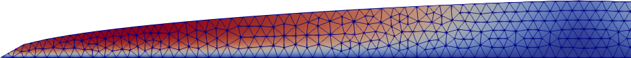

# stokes-ice-tutorial

To do this tutorial, read `slides/slides.pdf` and follow the stages.  Each stage is self-contained, with increasing sophistication.  In `stage1/` and `stage2/`, mesh-generation and Stokes solution are separated, but later stages combine these actions into a single program.

All codes are in Python and use the [Firedrake](https://www.firedrakeproject.org/) library, which calls [PETSc](https://www.mcs.anl.gov/petsc/) to solve the equations.  See the [Firedrake install directions](https://www.firedrakeproject.org/download.html) to install both libraries.  Note that each time you run Firedrake you need to activate the Python venv: `source firedrake/bin/activate`.

For `stage1/` and `stage2/` you will need [Gmsh](https://gmsh.info/) to generate the meshes.  For all stages, [Paraview](https://www.paraview.org/) is used for visualizing the results.

