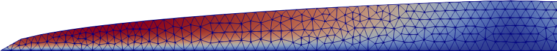

# stokes-ice-tutorial

The Glen-Stokes equations describe the ice in a [glacier](https://en.wikipedia.org/wiki/Glacier) or [ice sheet](https://en.wikipedia.org/wiki/Glacier) as a gravity-driven, viscous, shear-thinning flow:

$$\begin{align*}
-\nabla \cdot \tau + \nabla p &= \rho_i \mathbf{g} & &\text{stress balance} \\
\nabla \cdot \mathbf{u} &= 0 & &\text{incompressibility} \\
\tau &= B_n |D\mathbf{u}|^{(1/n)-1} D\mathbf{u} & &\text{Glen flow law}
\end{align*}$$

This repository contains a practical tutorial on solving these coupled [partial differential equations](https://en.wikipedia.org/wiki/Partial_differential_equation) numerically, by using the [finite element method](https://en.wikipedia.org/wiki/Finite_element_method).

The [Python](https://www.python.org/) programs here are relatively-short and only solve idealized problems.  We do not use any observational data from real glaciers.

### prerequisites

We use the [Firedrake](https://www.firedrakeproject.org/) library, which calls [PETSc](https://petsc.org/) to solve the equations.  See the [Firedrake install directions](https://www.firedrakeproject.org/download.html) to install both libraries.  Note that each time you start Firedrake you will need to activate the Python virtual environment:

    source venv-firedrake/bin/activate

Also, for `stage1/` and `stage2/` you will need [Gmsh](https://gmsh.info/) to generate the meshes, and for all stages I recommend [Paraview](https://www.paraview.org/) to visualize the results.

### stages

To do this tutorial, read `slides.pdf` and follow the stages.  Each stage is self-contained, with increasing sophistication.  Stages 1 through 4 have 2D geometry and stage 5 has 3D geometry.  All stages currently use direct solvers, which limits ultimate performance, but they all allow parallel runs.

In `stage1/` and `stage2/`, mesh-generation and Stokes solution are separate actions.  Mesh generation uses [Gmsh](https://gmsh.info/) on `.geo` geometry-outline files, which generates `.msh` mesh files.

Stages 3 through 6 combine these actions into a single program by using extruded meshes, so the entire mesh management is through [Firedrake](https://www.firedrakeproject.org/).  `stage3/` and `stage4/` are in 2D, and the only purpose of the latter is to show more scalable and robust numerics, and much better diagnostics.

`stage5/` shows a 3D ice sheet with a bumpy bed.  The use of parallel computation for performance, and performance issues generally, are substantially more important in 3D.

FIXME `stage6/` is an under-development time-stepping demonstration, again in 2D space.

## another playground

I have written another open-source Stokes solver for glaciology, with a different emphasis.  It uses the same Firedrake/PETSc/Gmsh/Paraview stack:

  * [`py/stokes/` directory in my McCarthy materials](https://github.com/bueler/mccarthy/tree/master/py/stokes)
