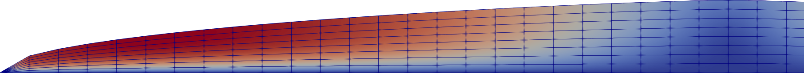

# stokes-ice-tutorial

## model equations

The Glen-Nye-Stokes equations describe the dynamics of ice in a [glacier](https://en.wikipedia.org/wiki/Glacier) or [ice sheet](https://en.wikipedia.org/wiki/Glacier) as a gravity-driven, viscous, shear-thinning flow:

$$\begin{align*}
-\nabla \cdot \tau + \nabla p &= \rho_i \mathbf{g} & &\text{stress balance} \\
\nabla \cdot \mathbf{u} &= 0 & &\text{incompressibility} \\
\tau &= B_n |D\mathbf{u}|^{(1/n)-1} D\mathbf{u} & &\text{Glen-Nye flow law}
\end{align*}$$

The free surface of a glacier is governed by an additional equation, coupled to the above, which has the [surface mass balance]() as a source term:

$$\begin{align*}
\frac{\partial s}{\partial t} - \mathbf{u}|_s \cdot \mathbf{n}_s &= a \hspace{10mm} \text{free-surface kinematics}
\end{align*}$$

This repository contains a practical tutorial on solving these coupled [partial differential equations](https://en.wikipedia.org/wiki/Partial_differential_equation) numerically, by using the [finite element method](https://en.wikipedia.org/wiki/Finite_element_method).

The [Python](https://www.python.org/) programs here are relatively-short and only solve idealized problems.  We model 2D and 3D land-based glaciers with moving margins.  The emphasis is on modern and robust solver techniques.

### prerequisites

We use the [Firedrake](https://www.firedrakeproject.org/) library, which calls [PETSc](https://petsc.org/) to solve the equations.  See the [Firedrake install directions](https://www.firedrakeproject.org/install.html) to install both libraries.  Note that each time you start Firedrake you will need to activate the Python virtual environment:

    source venv-firedrake/bin/activate

You will need [Gmsh](https://gmsh.info/) to generate certain meshes (but only for `stage1/` and `stage2/`).  For all stages [Paraview](https://www.paraview.org/) is recommended to visualize the results.

### tutorial in stages

To do this tutorial, read `slides.pdf` and follow the stages.  Each stage is essentially self-contained, with increasing sophistication.  

The first three stages use fixed geometry and address how to solve the Glen-Nye-Stokes equations for the dynamics of ice.

In `stage1/` and `stage2/`, mesh-generation and Stokes solution are separate actions.  Mesh generation uses [Gmsh](https://gmsh.info/) on `.geo` geometry-outline files, which generates `.msh` mesh files.

`stage3/` combines meshing and solving into a single program by using extruded meshes.  (Mesh management is entirely through [Firedrake](https://www.firedrakeproject.org/), but the base mesh could be read from a `.msh` if desired.)  For this stage one can choose 2D (planar) or full 3D glacier geometry at runtime.

`stage4/` solves the coupled system above, only in 2D (planar).  That is, we combine the Glen-Nye-Stokes dynamics model with the free-surface equation.  The coupled system, which is solved by time-stepping for a moving-margin case by default, permits the glacier to evolve in response to a climate (surface mass balance) model.  Several advanced and recent techniques are applied in this stage.

All stages can be run in parallel.

## known limitations

  * We do not use any observational data from, and thus we do not actually model, any real glaciers.
  * We do not model sliding, nor floating ice.
  * The stages all currently use direct solvers, which limits scalability, especially in 3D.
  * The time-stepping in `stage4/`, though apparently very well-behaved under the applied stabilization and adaptive techniques, remains mostly-explicit and CFL-limited.
  * In moving-margin cases only, there is a mass-conservation error committed at the free boundary.
  * In `stage3/` and `stage4/`, reading a `.msh` for the base mesh requires code modifications.
  * In `stage4/`, adding a surface mass balance requires code modifications.

## other glacier-related Firedrake solvers

  * I wrote an earlier open-source Stokes solver for glaciology.  It uses the same Firedrake/PETSc/Gmsh/Paraview stack.  See the `py/stokes/` directory [in my McCarthy materials](https://github.com/bueler/mccarthy/tree/master/py/stokes).

  * [Icepack](https://icepack.github.io/) by Dan Shapero and others is a general-purpose glacier and ice-sheet modeling framework based on Firedrake.
