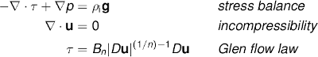

# stokes-ice-tutorial

The Glen-Stokes equations describe the ice in a [glacier](https://en.wikipedia.org/wiki/Glacier) or [ice sheet](https://en.wikipedia.org/wiki/Glacier) as a gravity-driven, viscous, shear-thinning flow.  This repository contains a practical tutorial on numerically-solving these coupled [partial differential equations](https://en.wikipedia.org/wiki/Partial_differential_equation) using the [finite element method](https://en.wikipedia.org/wiki/Finite_element_method).  The [Python](https://www.python.org/) programs here are relatively-short and only solve idealized problems; we do not use any observational data from real glaciers.

### stages

To do this tutorial, read `slides/slides.pdf` and follow the stages.  Each stage is self-contained, with increasing sophistication.  In `stage1/` and `stage2/`, mesh-generation and Stokes solution are separated, but later stages combine these actions into a single program.  `stage3/` shows extruded meshes,
`stage4/` shows better convergence and diagnostics, and `stage5/` is a 3D ice sheet.  All stages allow parallel runs.

### prerequisites 

These Python programs use the [Firedrake](https://www.firedrakeproject.org/) library, which calls [PETSc](https://www.mcs.anl.gov/petsc/) to solve the equations.  See the [Firedrake install directions](https://www.firedrakeproject.org/download.html) to install both libraries.  Note that each time you run Firedrake you will need to activate the Python venv: `source firedrake/bin/activate`.  For `stage1/` and `stage2/` you will need [Gmsh](https://gmsh.info/) to generate the meshes.  For all stages, [Paraview](https://www.paraview.org/) is needed for visualizing the results.
